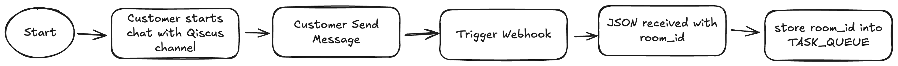
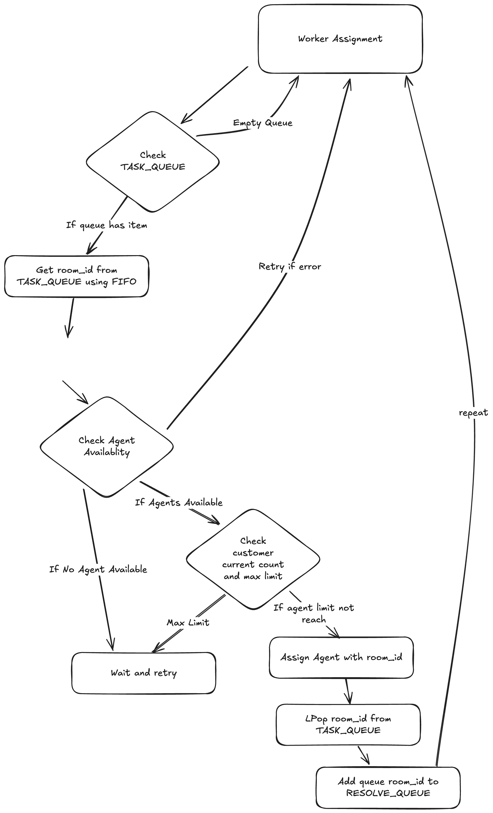
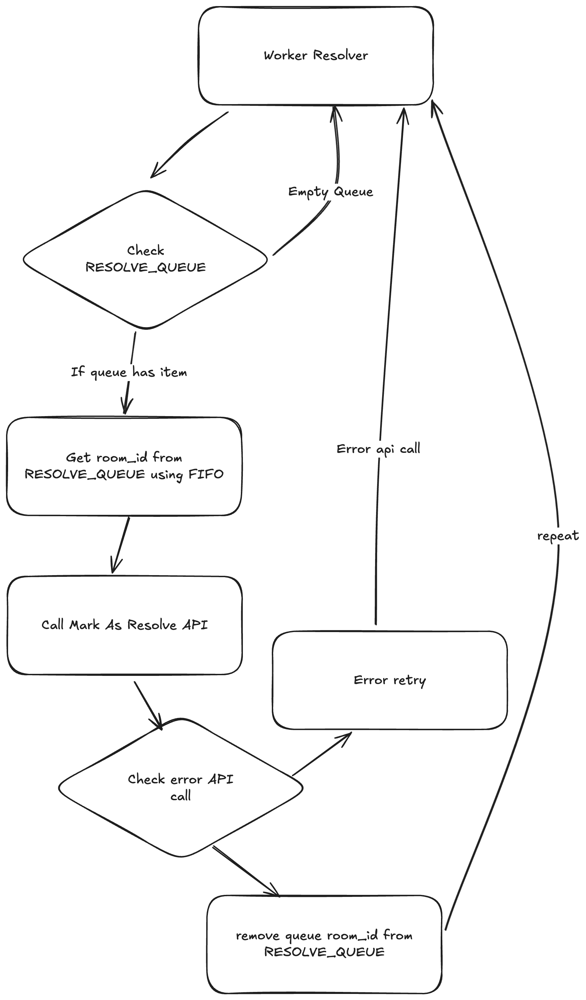

# QISCUS TEST

---

## How Webhook Works

### Flowchart of webhook

### Flowchart of Woker Assignment

### Flowchart of Woker Assignment

This Golang service functions to handle the allocation of incoming chats to available agents. There are 2 workers that run continuously to check whether there are queues or not: Worker Assignment and Worker Resolver. Worker Assignment functions to retrieve the room_id queue from Redis TASK_QUEUE and then assign available agents. Worker Resolver functions to resolve each room_id that has been assigned.

## Process Flow

1. The process begins when a customer starts a chat with the Qiscus channel
2. When the customer starts a chat and sends a message, the webhook will be triggered
3. The message is in JSON format, which contains fields including room_id. This room_id will be stored in a queue named `TASK_QUEUE`
4. There are 2 workers that will process the queue: worker assignment and worker resolver. Worker assignment will process the `TASK_QUEUE` containing the queue of incoming customer chat room_id. In this case, it retrieves room_id from the queue using FIFO (First In, First Out) principle
5. Worker assignment will then check available agents based on their online/offline status by getting data from the get available agent API, as well as checking whether the customer's current load has reached the maximum or not. Then it assigns an agent to the room_id. After that, the room_id will be LPop (first in order) from Redis and then inserted into the RESOLVE_QUEUE
6. Subsequently, Worker Resolver will resolve each room_id queue in the RESOLVE_QUEUE by retrieving from the queue using LIndex to get the first queue that entered, then making a resolve API call. If the resolve API call is successful, the queue will be LPop to remove it from the queue
7. The process repeats again
