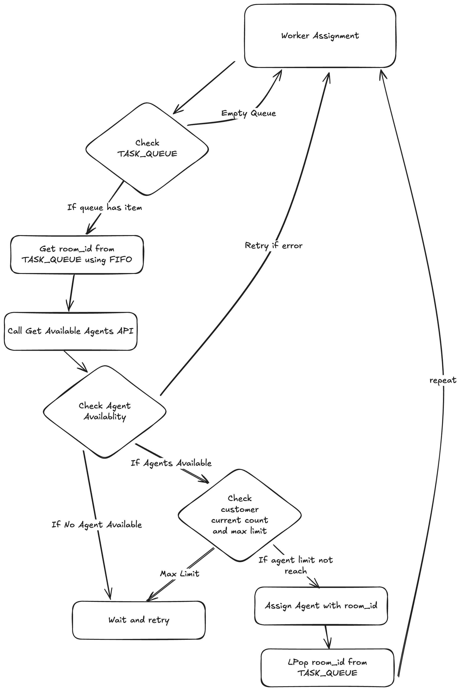

# QISCUS TEST

---

## How to setup

### Requirements

1. Redis
2. Golang 1.24.3

### Step-by-step

1. Please prepare redis service you can using docker or redis provider like Upstash.com
2. Adjust enviroment variable in `.env` file
3. Run `go mod tidy`
4. Run `go run main.go serve` to run project

### Note

You can find any `APP_ID`,`SECRET_KEY` and `CHANNEL_ID` in current `.env` file

## How Webhook Works

### Flowchart of webhook

### Flowchart of Woker Assignment

This Golang service functions to handle the allocation of incoming chats to available agents. i use go routine mechanism to create worker, lets name it Worker Assignment. Worker Assignment functions is to retrieve the room_id queue from Redis TASK_QUEUE and then assign available agents.

## Process Flow

1. The process begins when a customer starts a chat with the Qiscus channel
2. When the customer starts a chat and sends a message, the webhook will be triggered
3. The message is in JSON format, which contains fields including room_id. This room_id will be stored in a queue named `TASK_QUEUE`
4. There are 2 workers that will process the queue: worker assignment and worker resolver. Worker assignment will process the `TASK_QUEUE` containing the queue of incoming customer chat room_id. In this case, it retrieves room_id from the queue using FIFO (First In, First Out) principle
5. Worker assignment will then check available agents based on their online/offline status by getting data from the get available agent API, as well as checking whether the customer's current load has reached the maximum or not. Then it assigns an agent to the room_id. After that, the room_id will be LPop (first in order) from Redis
6. The process repeats again
